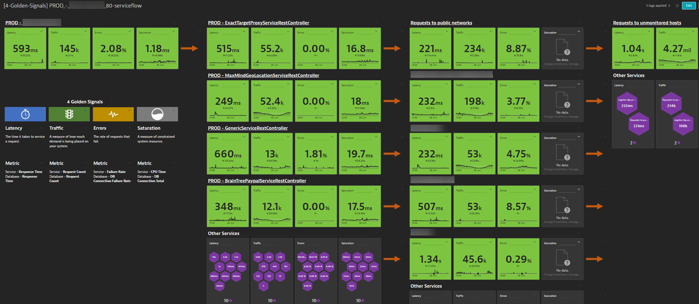

## Disclaimer
These projects are not supported by Dynatrace. 

Any issues please utilize github issues. 
We will try our best to get to your issues.

# Dynatrace Service Flow Dashboard

This is a Monaco Project that automates the creation of Dynatrace Service Flow Dashboards.

This project creates a Dynatrace Monaco based dashboard configuration that you can use to create a service flow dashboard as shown below:

### Technology Based Dashboard



## Pre-requisites 
1. Installing Dynatrace Monaco

```bash
https://dynatrace-oss.github.io/dynatrace-monitoring-as-code/Get-started/installation
```

2. Create a Dynatrace API-Token with the following permissions

To learn more about API Tokens check out [Dynatrace API Tokens](https://www.dynatrace.com/support/help/dynatrace-api/basics/dynatrace-api-authentication)

```
API v2 scopes
- Read entities
- Write entities
- Read settings
- Write settings
- Read Metrics

API v1 scopes
- Read configuration
- Write configuration
```
## Pre-requisites (Python)

1. Installing Python Version 3

```bash
https://www.python.org/download/releases/3.0/
```

2. Installing Python Libaries
```bash
pip install -r stable-req.txt
```

## Usage to create 4 golden signal serviceflow
1. Edit the _environments.yaml:
Create a copy of _environments.yaml.
```bash
cp _environments.yaml environments.yaml
```
- Replace ENVNAME with your environment name

2. Execute the Service Flow script
###### &nbsp;&nbsp;&nbsp;&nbsp;&nbsp;&nbsp;&nbsp;&nbsp;&nbsp;&nbsp;&nbsp;&nbsp;Supported Args:
###### &nbsp;&nbsp;&nbsp;&nbsp;&nbsp;&nbsp;&nbsp;&nbsp;&nbsp;&nbsp;&nbsp;&nbsp;&nbsp;&nbsp;&nbsp;&nbsp;&nbsp;&nbsp;Required:
-  -dtUrl  --dynatrace-url Dynatrace URL (https://*.live.com)
-  -dtToken  --dynatrace-api-token Dynatrace API Token
-  -svcId  --service-id Id of the service you are interested in.
-  -owner  --dashboard-owner  Owner of the Dynatrace Dashboard
-  -shared  --dashboard-shared  Set Dynatrace Dashboard to shared
-  -preset  --dashboard-preset  Set Dynatrace Dashboard to preset
-  -timeFrame  --dashboard-timeFrame Time Frame to evaluate thresholds
-  -warn --warn-percent Percent at which to be warned via threshold
-  -pass --pass-percent Percent at which to be passed via threshold
###### &nbsp;&nbsp;&nbsp;&nbsp;&nbsp;&nbsp;&nbsp;&nbsp;&nbsp;&nbsp;&nbsp;&nbsp;&nbsp;&nbsp;&nbsp;&nbsp;&nbsp;&nbsp;Optional:
- -am, --auto-monaco    Use this to automatically execute monaco to deploy dashboards. (missing = false)
- -sre, --sre-tag  Use this to only include services tagged with 'sre' as part of the serviceflow.

### PYTHON
```bash
python serviceFlow.py -dtUrl https://*.live.com -dtToken DTAPITOKEN -svcId SERVICE-ID -owner OWNER -shared true/false -preset true/false -timeFrame now-1d -warn 5 -pass 10
```

This will generate a new directory for the Servie Flow Dashboard.
This is a monaco project that will contain a dashboard.json and a dashboard.yaml. The dashboard.yaml contains all the pass/warn values generated from the baseline

3. Review the dashboard.yaml

The dashboard.yaml contains all metric thresholds based on the reference timeframe. Feel free to adjust the thresholds before applying the dashboard configuration through monaco!

4. Execute Monaco (optional if you didn't use -am to automatically run monaco)
```bash
	monaco --environments=environments.yaml 'SERVICENAME-serviceflow/'
```
