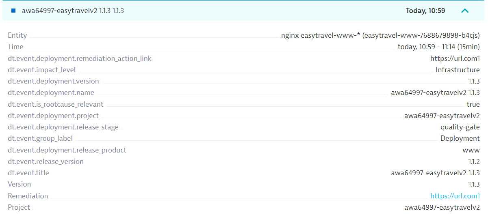
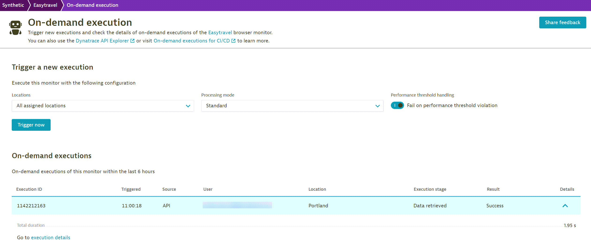
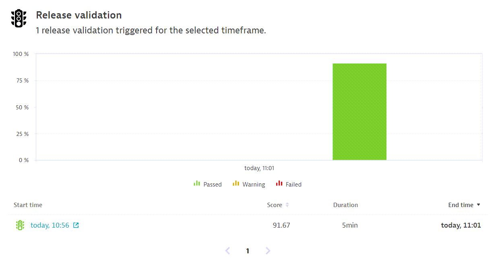

> **_Disclaimer:_** This script is not supported by Dynatrace. Please utilize github issues for any issues that arrise. We will try our best to get to your issues.

# Gitlab DevOps Pipeline integrated with Dynatrace
This project provides a plug-and-go Gitlab pipeline integrated with Dynatrace. Included are stages to monitor a release, validate a deployment and release with Dynatrace.

The first stage - *release-automation* - makes use of the Dynatrace Automation Bootstrap solution - Release Automation. This stage will take inputs to monitor a release via the Dynatrace Events v2 API. As well as, optional inputs to generate SLOs and/or a Release Dashboard for all processes/services related to the release.

The second stage - *deploy-validation* - makes use of the Dynatrace onDemand Synthetic Execution. This stage validates the deployment by executing pre-defined synthetics to test the rest endpoints of the application. The synthetics must be tagged with the following: deploy-validation, project:{PROJECt}, stage:{STAGE}, service:{PRODUCT}

The final stage - *release-validation* - makes use of the Dynatrace Cloud Automation module to run a evaluation sequence. The sequence will get all SLIs, evaluate the SLIs and determine a SLO score. Finally, an evaluation event is posted to Dynatrace.

### Pre-requisites
###### 1. Gitlab
1. Create GitLab variables for the following: 
   - DTTOKEN - Dynatrace token to authorize API requests
   - DTSYNTHETICTOKEN - Dynatrace token with synthetic permissions
   - DTURL - Dynatrace url of the tenant
   - CATOKEN - Dynatrace Cloud Automation token to authorize API requests
   - CAURL - Dynatrace Cloud Automation url of the tenant
2. Adjust the variables in .gitlab-ci.yml by using your own variables or gitlab provided ones: [Gitlab predefined variables](https://docs.gitlab.com/ee/ci/variables/predefined_variables.html)
###### 2. Dynatrace
1. Create the following access tokens:
   - gitlab-dynatrace-release-token, with the following permissions:
     - API v2 scopes
       - Read entities
       - Write entities
       - Ingest events
       - Read metrics
       - Write metrics
       - Read SLO
       - Write SLO
     - API v1 scopes
       - Access problem and event feed, metrics, and topology
       - Read configuration
       - Write configuration
   - gitlab-dynatrace-synthetic-token, with the following permissions:
     - API v2 scopes
       - Read Geographic regions
       - Read synthetic monitor execution results
       - Write synthetic monitor executions
       - Read synthetic locations
       - Write synthetic locations
     - API v1 scopes
       - Create and read synthetic monitors, locations, and nodes
       - Read synthetic monitors, locations, and nodes
2. Tag Process Group/Processes with the following:
   - keptn_managed
   - keptn_service:{VALUE}
3. Create a release validation dashboard using: [Dynatrace Automation Bootstrap solution - Release Validation Dashboard](https://github.com/dynatrace-perfclinics/cloud-automation/tree/main/release-validation-dashboards) or another dashbord which SLIs can be retrieved
###### 3. Dynatrace Cloud Automation (optional for release-validation support)
1. Create a Cloud Automation token
2. Create a project/stage/service using: [Dynatrace Automation Bootstrap solution - Release Validation Dashboard](https://github.com/dynatrace-perfclinics/cloud-automation/tree/main/release-validation-dashboards) or manually through Cloud Automation Bridge

### Available Parameters
###### &nbsp;&nbsp;&nbsp;&nbsp;&nbsp;&nbsp;&nbsp;&nbsp;&nbsp;&nbsp;&nbsp;&nbsp;Supported Variables:
- PROJECT - Cloud Automation project
- STAGE - Cloud Automation stage
- PRODUCT - Cloud Automation product
- VERSION - Release version
- BUILDID - Build version
- DTTOKEN - Dynatrace release token
- DTSYNTHETICTOKEN - Dynatrace synthetic token
- DTURL - Dynatrace url
- CATOKEN - Cloud Automation token
- CAURL - Cloud Automation url
- IDENTIFIER - Process Group ID, Service ID, or Tags (1 or more seperate by commas)
- REMURL - gitlab remediation url
- OWNER - Dynatrace verified user
- SHARED - Dashboard permission (true/false)
- PRESET - Dashboard preset (true/false)
- TIMEFRAME - timeframe to evaluate (now-5m - last 5 minutes, now-1d - last 1 day)
- MINUTEDIFF - time difference in minutes of the evaluation
- DAYDIFF - time difference in days of the evaluation
- DAYSTART - time difference in days of which the evaluation will start
- PASS - percentage to determine thresholds for SLOs/Tiles based on aggregation (50 - thresholds would be set at 50% above the observed aggregate)
- SLO - create SLOs ("-slo")/don't create SLOs ("" - empty string)
- DASHBOARD - create Dasbhoard ("-dashboard")/don't create Dashboard("" - empty string)
